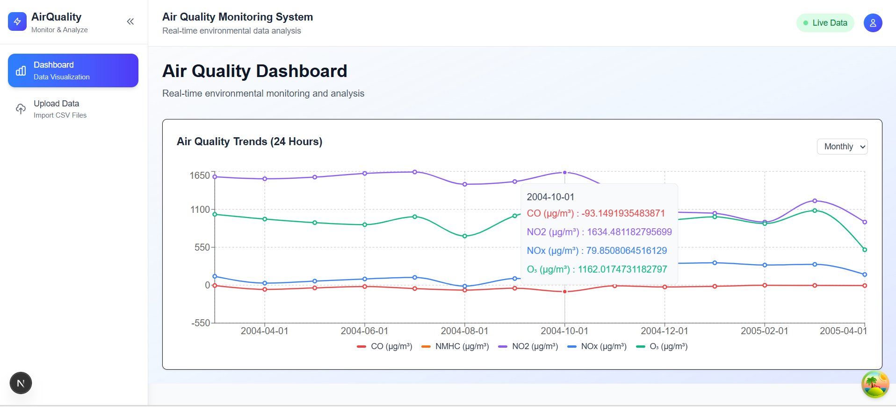
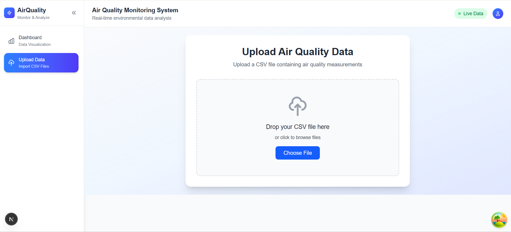

## Tech Stack

- **Next.js 15** - React framework
- **React 19** - UI library
- **TypeScript** - Type safety
- **Tailwind CSS** - Styling
- **TanStack Query** - Data fetching and caching
- **Recharts** - Data visualization
- **React Hot Toast** - Notifications

## Routes

The application has two main routes:

- **`/dashboard`** - Air Quality Dashboard with real-time environmental monitoring and data visualization charts
- **`/upload`** - File Upload page for uploading CSV files containing air quality measurements

## Getting Started

First, run the development server:

```bash
npm run dev
# or
yarn dev
# or
pnpm dev
# or
bun dev
```

Open [http://localhost:3000](http://localhost:3000) with your browser to see the result

## Screengrabs





